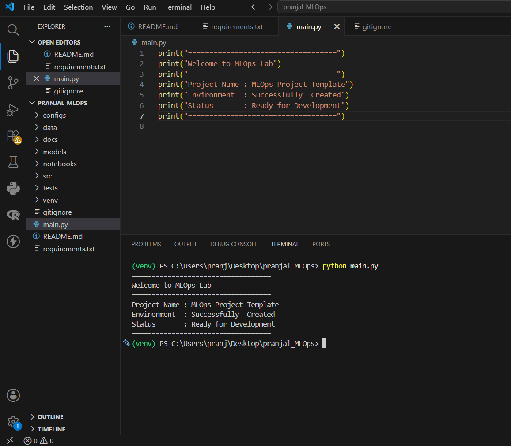

# 📊 ETL Pipeline using Python

## 📌 Project Overview

This project demonstrates a simple **ETL (Extract, Transform, Load)** pipeline using Python and Pandas. The pipeline reads a sales dataset, cleans the data, performs basic transformations, and saves the cleaned dataset.

---

## 🚀 Features

- 📥 Read CSV dataset
- 🧹 Remove duplicate records
- 🔍 Check missing values
- 📊 Create a new column (`Sales_per_Item`)
- 💾 Save cleaned dataset to a new CSV file

---

## 🛠 Technologies Used

- Python
- Pandas
- NumPy
- CSV
- VS Code

---

## 📂 Project Structure

```text
ETL-Pipeline/
│── superstore_sales.csv
│── cleaned_superstore_sales.csv
│── etl_pipeline.py
│── requirements.txt
│── README.md
│── output.png
```

---

## ⚙️ Installation

```bash
pip install -r requirements.txt
```

---

## ▶️ Run the Project

```bash
python etl_pipeline.py
```

---

## 🔄 ETL Process

### 📥 Extract
- Read the Superstore Sales dataset using Pandas.

### 🔄 Transform
- Remove duplicate rows.
- Check missing values.
- Create a new column named **Sales_per_Item**.

### 📤 Load
- Save the cleaned dataset as **cleaned_superstore_sales.csv**.

---


## 📷 Output

## 📷 Output



---

## 📈 Skills Demonstrated

- ETL Pipeline Development
- Data Cleaning
- Data Transformation
- CSV Processing
- Pandas
- Python Programming

---

## 👨‍💻 Author

**Pranjal Dhamane**
